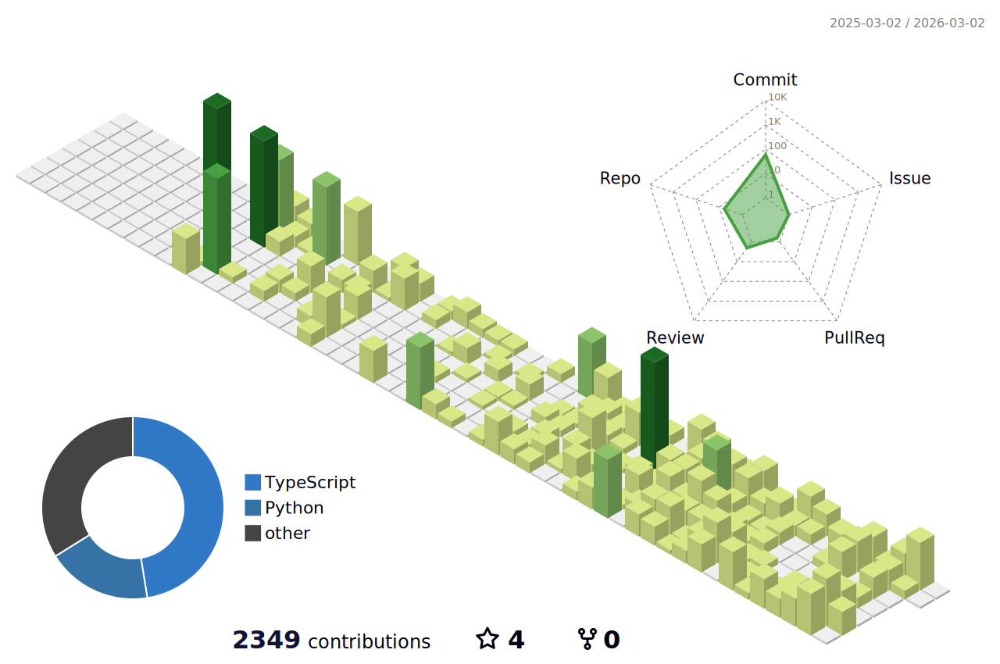

  <h1>Ryan Guo</h1>
  <h3>Founder @Latent-Hack | Product Builder | 15yo Developer</h3>

   

  <h2>"Building in the Latent Space."</h2>

   

  
  

---

### 🧑‍💻 The Profile

I am a builder based in **Australia**.
I explore the intersection of **Structured Logic** and **Generative Aesthetics**. I don't just write code; I orchestrate AI agents to turn philosophy into shipping products.

- ⚡ **Core Philosophy:** **AQ (Aesthetic Quotient) > IQ** in the age of AI.
- 🔭 **Primary Focus:**
  - **[Latent Hacks](https://hack.aq16.org):** Exploring the *Latent Space* of **Human Aesthetics**. (Non-Profit)
  - **[ThinkFirst](https://www.thinkfirstapp.com/):** Mapping the *Latent Space* of **Human Logic**. (SaaS)

   
  <picture>
    <source media="(prefers-color-scheme: dark)" srcset="./profile-3d-contrib/profile-night-green.svg">
    <source media="(prefers-color-scheme: light)" srcset="./profile-3d-contrib/profile-green.svg">
    
  </picture>
   

---

### 🚀 The Portfolio

| Project | Role | Concept & Stack |
| :--- | :--- | :--- |
| **Latent Hacks** *(Founder)* | **The Aesthetic Engine** Built the dual-site architecture for the world's first Aesthetic RLHF exhibition. ✨ *Fiscally sponsored by Hack Club Bank (501c3).* 🌐 [hack.aq16.org](https://hack.aq16.org) • [aq16.org](https://aq16.org) |   |
| **ThinkFirst** *(Creator)* | **The Logic Engine** A SaaS tool turning messy thoughts into structured maps using recursive AI questioning. 🚀 [thinkfirstapp.com](https://www.thinkfirstapp.com/) |   |

---

### 🛠️ The Stack

Tools that allow high-velocity building in the latent space.

**Ship Fast (Web & Systems):**

**Think Deep (Agents & Data):**

---

  

