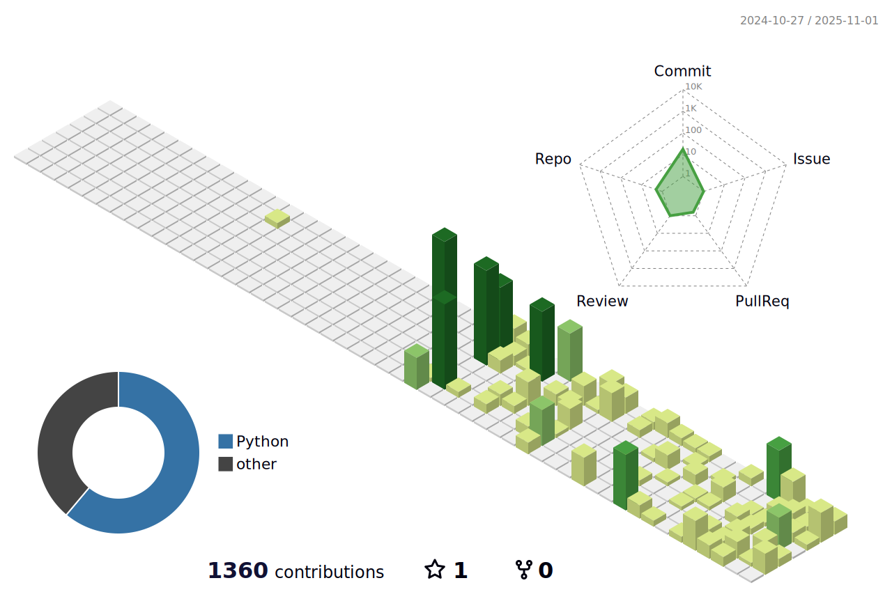

<!-- Profile Header -->
<h1 align="center">👋 Hi, I'm Ryan</h1>
<h3 align="center">🌱 Beginner Programmer | 🤖 AI Explorer | 🎨 Creative Thinker</h3>

---

### 🧑‍🎓 About Me / 关于我

- 🇦🇺 I'm a high school student in Australia  
- 🐣 A **beginner in programming**, currently learning Python · Swift · Web · CS50  
- 🤖 Passionate about **Artificial Intelligence & Creative Technology**  
- 🌏 I’m originally from China, so I speak **Chinese & English**  🇨🇳 🇦🇺
- 🎯 Learning step by step and dreaming big — one day I hope to study at the University of Melbourne and create my very own AI projects 💻✨  
- 📷 I love photography, art, cultural creativity, and coming up with weird-but-fun ideas that probably shouldn’t work… but somehow do 😆  

  <picture>
    <!-- 深色模式 -->
    <source media="(prefers-color-scheme: dark)" srcset="./profile-3d-contrib/profile-night-green.svg">
    <!-- 浅色模式 -->
    <source media="(prefers-color-scheme: light)" srcset="./profile-3d-contrib/profile-green.svg">
    <!-- 如果浏览器不支持自动切换，就显示浅色版 -->
    
  </picture>

---

### 🚀 What I'm Learning / 最近在学

| 技术方向 | 内容 |
|----------|--------------------------------------|
| 💻 Programming Basics | Python · Swift · Git/GitHub |
| 🤖 AI | OpenAI · AI Agents · MCP |
| 🛠 Project | [ha-ai-daily-brief](https://github.com/Ryan-Guo123/ha-ai-daily-brief) |

---

### 🛠 Tech & Tools / 会一点点的工具

| Languages | Tools | AI & Others |
|-----------|--------------------|-----------------------------|
| Python · C · Swift | VS Code · GitHub · Git · Docker · OrbStack | Claude Code · Ollama |
| *Learning...* | Figma · Canva · DaVinci Resolve · Obsidian | MCP · Agents |

---

### 📊 GitHub Stats

  

---

### 📫 Connect with Me

| Platform | Info |
|----------|----------------------------|
| 🐙 GitHub | <https://github.com/Ryan-Guo123> |
| 📧 Email | Ryan-Guo123@email.com |
| 🌐 Website / Blog | *Under construction... / 正在建设中...* |

---

⭐ *If you like my journey or projects, feel free to follow or star!  
要是喜欢我的作品，点个 Star 或 Follow 就是最大的鼓励！*
